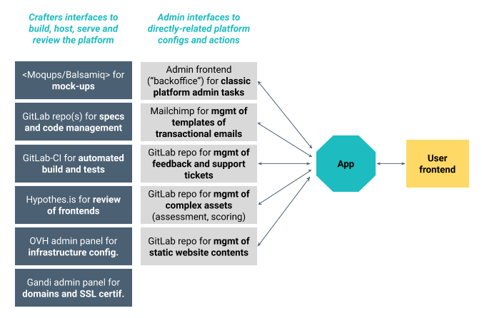

# Premières réflexions sur l'architecture de l'application

## Composants principaux

- Assets :
  - L'assessment en lui-même (les assessements en réalité, cf. [Gestion des multiples versions de référentiels d'évaluation](#gestion-des-multiples-versions-de-référentiels-dévaluation))
  - Le(s) modèle(s) de scoring attaché(s) à un référentiel d'évaluation
  - Contenus textuels additionnels : textes de page d'accueil, FAQ, CGU, mentions légales

- Frontend :
  - Page d'accueil
  - Affichage des éléments de l'assessment pour que l'utilisateur interagisse
  - Synthèse de la progression dans l'assessment
  - Synthèse des résultats de l'assessment
  - Faire un feedback sur un élément de l'assessment
  - Page de profil / réglages

- Backend :
  - Créer un assessment vierge pour un utilisateur, enregistrer son état / ses changements d'état
  - Créer un assessment nouveau à partir d'un assessment existant dans une précédente version ("en cours" ou "terminé")
  - Calculer le score à partir de la grille de notation associée à l'évaluation
  - Authent/Ident

- Emailings transactionnels :
  - Templates dans Mailchimp
  - Déclenchement et instructions côté backend

## Interfaces de création et d'administration

