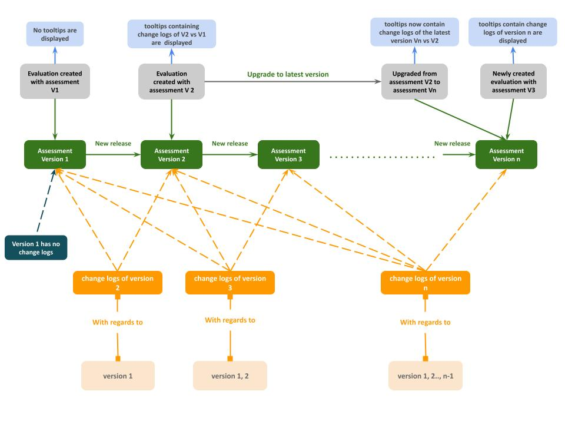

# Gestion des multiples versions de référentiels d'évaluation

Le référentiel d'évaluation est amené à évoluer, avec l'évolution de l'état de l'art, les retours d'expérience des organisations qui s'évaluent, etc. Il est donc crucial de savoir gérer le plus proprement possible ces évolutions. D'autant plus que :

- le référentiel d'évaluation est open source et participatif. Son évolution est donc soumise à une gouvernance ouverte, elle ne peut se faire de manière discrétionnaire (sauf pour des modifications très mineures, de type fautes d'orthographe ou de ponctuation)
- une fois la plateforme lancée publiquement, il existera des évaluations terminées et des évaluations en cours. L'évolution du référentiel d'évaluation a donc immédiatement des impacts à prendre en compte sur les utilisateurs. Elle ne peut se faire trop fréquemment

On peut envisager l'approche suivante lorsqu'une nouvelle version du référentiel d'évaluation est disponible :

1. Les évaluations déjà existantes (en statut "en cours" ou "terminé") **restent telles quelles**
1. Il est proposé à l'utilisateur disposant d'évaluations existantes de **les migrer dans une version plus récente**
1. Une migration d'une évaluation existante vers une version plus récente consiste à :
   - instancier une nouvelle évaluation dans la version plus récente choisie
   - récupérer en base la liste des éléments d'évaluation inchangés entre la version de l'évaluation existante et la version cible
   - pour chaque élément inchangé, récupérer la réponse d'alors (_note : cela pourrait être laissé au choix de l'utilisateur ; dans certains cas il peut vouloir redémarrer une évaluation vierge_). Pour les éléments qui ont changé, laisser vierge

Conséquences à retenir :

- les référentiels d'évaluation existent en plusieurs versions qui coexistent en base de données
- chaque version du référentiel, à l'exception de la première, est liée à sa version précédente, à l'aide d'un attribut qui s'appelle *previous_assessment_version* 
- une "évaluation" est donc l'instanciation d'un certain référentiel d'évaluation (une certaine version)
- la coexistence de plusieurs référentiels d'évaluation est une notion distincte de la coexistence de plusieurs grilles de notation (*scoring models*) des évaluations. Il peut y avoir plusieurs versions successives de grilles de notation pour une même version du référentiel d'évaluation
- les évaluations ont un statut d'avancement, dont une valeur est "terminé"

## Modifications techniques nécéssaires

### Table des upgrades

- créer une table, `Upgrade`, contenant comme attribut : la version final de l'assessment, la version initiale, le `.json` des différences. 
- ajouter un champ lors import de l'assessment (dajngo admin) qui, lorsqu'il y a déjà un assessment en base de données, demande un fichier `.json` (voir structure ci-dessous)
- lors de la validation de l'import de ce json, il faut vérifier :
    - qu'on a bien importé un assessment avec (dans l'autre champ de l'import) et que celui-ci a bien un numéro de version supérieur
    - que l'attribut de version précédente de cette version fait référence à un assessment existant dans la base de données au moment de l'import
    - que pour chaque assessment en base de données, dans le fichier json, il y a bien un dictionnaire qui liste les différences
    - que le `.json` respecte le format (cf. structure ci-dessous)
- si le `.json` ne respecte pas le format, l'assessment et le scoring seront supprimées de la base de données même s'ils sont correctement importés
    
### Format du `.json` de versioning

- on a d'abord le numéro de version du nouvel assessment
- ensuite on a un dictionnaire pour chaque version antérieur (si le nombre de dictionnaires correspond pas au nombre de versions antérieurs : message d'erreur - c'est à la charge de celui qui édite le json)
- pour chaque dictionnaire de version, on a comme clé sa version qui a pour valeur le dictionnaire des différences
- le dictionnaire de version a pour clés les différents types d'objets d'un assessment (*sections*, *elements*, *answer_items*). Les sections et les éléments servent à indiquer si on récupère ou non les notes prises par les utilisateurs, les choix servent à indiquer si on récupère les sélections des utilisateurs.
- pour chaque type d'objet, on a un dictionnaire structurés en 3 sous-dictionnaires *sections*, *elements*, *answer_items*, avec :
   - comme clé les id des objets
   - comme valeur :
     - pour les *sections* et *answer_items* :
          - `no_fetch` s'il ne faut pas récupérer les notes ou sélections de la version précédente
          - `<id>` (sous-entendu `fetch <id>`) s'il faut récupérer la note ou la sélection de la version précédente pour cet objet
     - pour elements
       - un autre dictionnaire qui a comme clé :
            - `pastille_fr`: c'est le marqueur ou *la pastille* qui sera affiché sur l'en-tête des éléments d'évaluation, en français
              - qui a comme valeur :
                 - `Inchangé`, `Nouveau` ou `Mise à jour` 
                
            - `pastille_en`: c'est le marqueur ou *la pastille*
              - qui a comme valeur la même valeur que `pastille_fr` mais en anglais : 
                 - `Unchanged`, `New` ou `Updated`
                
            - `edito_fr` :
                 - qui a comme valeur le texte qui explique le changement introduit par cette nouvelle version de l'assessment, en français
         
            - `edito_en`:
                 - qui a comme valeur la même valeur que `edito_fr`, mais en anglais
         
            - `upgrade_status` 
                   - qui a comme valeur `no_fetch` , `<id>` ou `1` 
- notes :
   - on ne peut pas indiquer de statut "deleted" car les clés sont celles de la nouvelle version, les éléments supprimés n'apparaissent donc pas. Mais ça n'est pas un problème, car on n'en a pas besoin : pour les migrations on commence par instancier une nouvelle évaluation en nouvelle version, on n'aura donc pas les éléments supprimés depuis.
   - on n'a pas besoin de la distinction entre "nouveau" et "modifié", car la conséquence est la même : on ne récupérera pas la note ou la section de la version précédente pour cet objet
   - avec ce format il est nécessaire de reprendre dans le `.json` tous les objets (*sections*, *elements*, *answer_items*) sans exception. Cela a le mérite d'assurer que l'on n'oublie rien, et également de faciliter les boucles de traitement


```json
{   "assessment_version" : "3.0",
    "diff_per_version" : {
            "1.0" : {           
                "sections" : {
                    "1": "1",
                    "2": "2",
                    "3": "3",
                    "4": "no_fetch",
                    "5": "no_fetch",
                    "6": "5",
                    "7": "7"
                },
                "elements" : {
                   "1.1": {
                        "upgrade_status": 1,
                        "pastille_fr": "Nouveau",
                        "pastille_en": "New",
                        "edito_fr": "C'est un nouvel élément",
                        "edito_en": "This is a new element"
                    },
                    "1.2": {
                        "upgrade_status": 1,
                        "pastille_fr": "Nouveau",
                        "pastille_en": "New",
                        "edito_fr": "C'est un nouvel élément",
                        "edito_en": "This is a new element"
                        
                    },
                    "2.1": {
                        "upgrade_status": "no_fetch",
                        "pastille_fr": "Inchangé",
                        "pastille_en": "Unchanged",
                        "edito_fr": "",
                        "edito_en": ""
                    },
                    "2.2": {
                        "upgrade_status": "2.1",
                        "pastille_fr": "Mis à jour",
                        "pastille_en": "Updated",
                        "edito_fr": "cet élément a été mis à jour",
                        "edito_en": "This element has been updated"
                    },
                  ...
                },
                "answer_items" : {
                    "1.1.a": "1.1.a",
                    "1.1.b": "no_fetch",
                    ...
                },
            "2.0" : {           
                "sections" : {
                    "1": "1",
                    "2": "2",
                    "3": "3",
                    "4": "4",
                    "5": "5",
                    "6": "6",
                    "7": "7"
                },
                "elements" : {
                    "1.1": "1.1",
                    ...
                },
                "answer_items" : {
                    "1.1.a": "1.1.a",
                    "1.1.b": "no_fetch",
                    ...
                }
            }   
     }
}
```

On peut deviner avec cet exemple :

- dans la version `1.0` il y avait une section de moins
- en passant en `2.0` la section 4 a été splittée en 2 sections
- au passage de la `2.0` à la `3.0` les sections sont restées identiques

*TO DO : compléter l'exemple avec plus de cas pour les _elements_ et les _answer_items_*.

## Les change-logs

Les *change-logs* sont des objets stockés dans la base de données, ils représentent les modifications apportées
aux éléments d'évaluation entre deux versions différentes de l'assessment. Par conséquent:
- Chaque version d'assessment est livrée avec ses propres *change-logs* par rapport à toutes les versions précédentes
- La première version de l'assessment ( ou
toute version de l'assessment qui n'a pas de version précédente) n'a pas donc de change-logs
- Chaque change-log est identifié par 3 choses:
  - `assessment`: l'objet d'assessment auquel ce change-log est lié
  - `previous_assessment`: l'object d'assessment précédent auquel nous comparons l'assessment  
  - `eval_element_numbering`: le *numbering* de l'élément d'évaluation auquel ce *change-log* est lié
- les *change-logs* sont créés à partir de la *table des upgrades* après son importation
- les *change-logs* sont affichés sous forme de *pastille* sur l'en-tête des éléments d'évaluation, 
ils sont visibles par défaut mais ils peuvent être masqués dans la page d'admin
- chaque *change-log* est lié à deux assessments différents comme nous l'avons indiqué précédemment,
si l'une d'entre eux est supprimé alors tous les *change-logs* qui se réfèrent à au moins l'un d'entre eux sont supprimés




## Modification du modèle et affichage utilisateur

- on va créer pour les objets composant l'évaluation (*section*, *element*, *answer_item*) un champ correspondant `no_fetch` ou `fetch <id>`
- lorsque l'on crée l'évaluation, on affectera à ces fields les valeurs présentes dans la table d'upgrade entre les 2 versions : celle de l'assessment choisit par l'utilisateur pour son évaluation, celle de l'assessment avec lequel l'évaluation originale avait été faite
- on initialise de manière vierge toutes les notes et les *answer_items* pour lesquels le champ est à `no_fetch`
- on initialise avec les valeurs (notes et sélections) de l'évaluation précédente tous les champs où le champ est à `fetch <id>`
- pour l'affichage, on aura une icone css dans le cas `no_fetch`. Ainsi, pour une section au sein de laquelle on a créé un nouvel élément d'évalaution, on aura une icone css "modified"

## FAQ sur les règles de gestion en place

1. Est-ce que quand un élément est en no_fetch, toutes les réponses du user sont effacées, y compris celles des items de réponse qui n'ont pas changé ?
   > Au 02.07.2021 : Non, les réponses aux items de réponse inchangés sont conservées. En revanche les notes et les justifications sont effacées et le macaron "New" est affiché à côté de l'élément

1. Est-ce que quand un élément est repris, et seulement un(des) item(s) de réponse sont en no_fetch, si le user avait coché un de ceux-là, ça retire l'élément des % d'avancement ?
   > Au 02.07.2021 : Dans l'hypothèse où le user se retrouve avec plus aucun item de réponse coché, alors oui, l'élément étant vierge il n'est pas compté comme terminé dans les % d'avancement.
